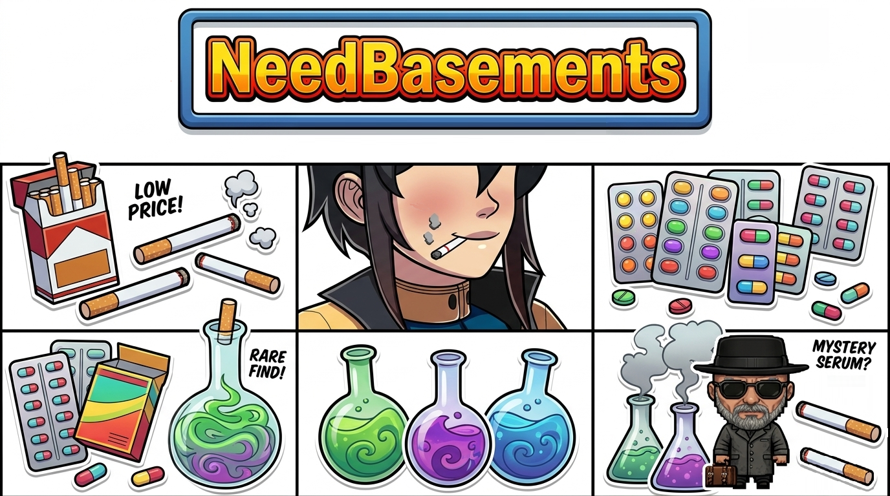

# NeedBasements

A substance addiction mod for **Third Crisis** that introduces a progressive system of dependency and consequence. A mysterious vendor in Carceburg offers substances that provide immediate benefits in combat — but at a growing cost. Each use deepens addiction, triggers cravings more frequently, and shifts Jenna's dialogue as she struggles with her choices.

## Overview

The mod creates a dynamic tension between mechanical advantage (combat buffs) and narrative/mechanical cost (addiction, relapse penalties, escalating debuffs). Substances are not just story flavor — they alter combat stats, but the effect grows weaker and more unstable as addiction rises.

## Seller Location

## Core Systems

### Addiction Stat
- **Base range:** 0–200+ (custom stat tracked on Jenna)
- Each substance consumption increases addiction by a base amount, but **relapse multipliers** can push gains to 2x, 3x, or higher
- Progression dialogue marks each threshold, from casual curiosity to full dependency

### The Four Substances
All available from the vendor in **Carceburg**:
- **Cigar** — Slow burn addiction, relaxing effect
- **Cigarette** — Quick fix, habitual consumption pattern
- **Cannabis** — Mellow high, prolonged duration
- **Pills** — Intense rush, steep addiction spiral

Each has unique **progression stages** (dialogue trees that change as addiction climbs) and distinct **combat modifiers** (see below).

### Combat Effects
While under the effect of a substance, Jenna gains temporary stat bonuses or penalties. **But:** these modifiers scale with her addiction level. Low addiction = base effect. High addiction = 2x or 3x multiplier, making buffs more potent **and** debuffs more painful.

- **Cigar** — Lust Defense `+4`, Movement Speed `-2`
- **Cigarette** — Lust Power `+4`, Movement Speed `-2`
- **Pills** — Physical Power `+8`, Physical Defense `-4`
- **Cannabis** — Energy `+3`, Lust Defense `-4`

### Craving System
The higher Jenna's addiction, the more frequently she craves her substance of choice. Cravings trigger unsolicited dialogue lines when she is *not* currently satisfied. Resisting cravings (abstaining) is a path to recovery — but relapsing after a period of abstinence triggers **escalating penalties** on the next use.

### Relapse Mechanic
- Stay clean for a while and your addiction naturally decreases
- Consume again after abstinence? The next use's addiction gain is **multiplied**:
  - 1st relapse: **2x** gain
  - 2nd+ relapse: **3x** gain (capped to maintain balance)
- Successfully reaching 0 addiction resets the relapse counter — you get a “fresh start”

This mechanic rewards commitment to abstinence but punishes yo-yo cycles.

### Gameplay Constraints
- **No mixing:** While one substance's effect is active (satisfaction duration), you cannot consume a different substance
- **Dynamic satisfaction duration:** Effects last longest at low addiction (up to 3.5 minutes) and shortest at high addiction (down to 25–35 seconds depending on substance)
- **Hangover dialogue:** Some substances trigger withdrawal lines when their effect ends, reinforcing the cost

## Design Philosophy

The mod is not about "winning" via substances — it's about **choice and consequence**. Substances offer real mechanical benefits, but at the cost of building dependency. The escalating relapse penalties and addiction-scaled modifiers create a curve where short-term power comes with long-term risk. Dialogue progression mirrors this mechanical journey, giving narrative weight to the spiral.

## Finding the Vendor

The vendor (a mysterious dealer) appears in **Carceburg** once you enter the area. His greeting and product availability change based on your addiction level and purchase history — he even raises prices as Jenna becomes a more loyal (desperate) customer.

Reference image link (Google Drive viewer):
- `https://drive.google.com/file/d/1MTDkmVVITz9Fy1sgxZUdsZG5DeIIeRlt/view?usp=sharing`

## Credits

Made by [hashXL](https://github.com/hashXL). Built on the official Third Crisis modding SDK — community Discord: `https://discord.gg/q8V9jKDGmk`.
